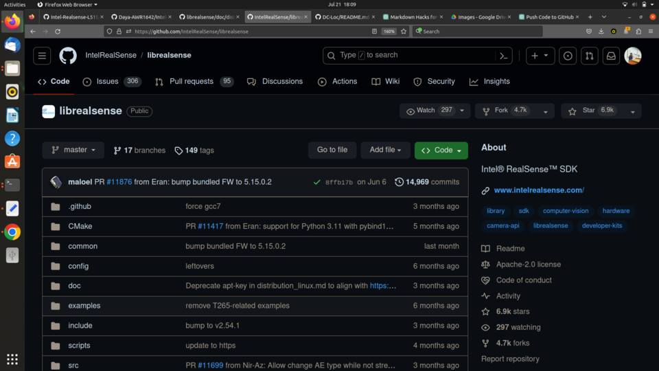
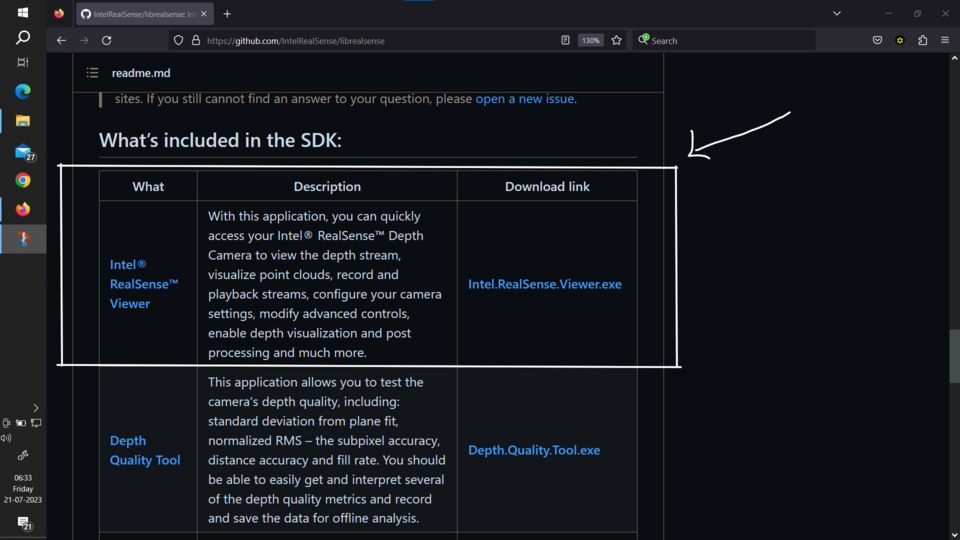

# Here I'll discuss step by step process to handle L515

## Installing Intel Realsense Viewer for windows 10

- Step 1:  [Click Here](https://github.com/IntelRealSense/librealsense/)
           
	   You will navigate to this Intel Official Github Repository

           Just scrolldown 

- Step 2: [Click Here](https://github.com/IntelRealSense/librealsense/releases)

           Here you are in the release repository of Intel Realsense 

